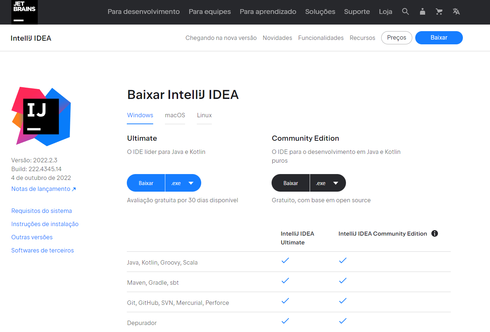

# backend-tcc
API para geração de CRUDs

## Pré Instalação

[Baixe a IDE IntelliJ](https://www.jetbrains.com/pt-br/idea/download/#section=windows) na versão 2021.2.1+ para importação do projeto:



## Instalação

Clone este repositório e abra-o através do IntelliJ.

Após a importação do projeto dentro da IDE, procure pela classe ``SpringGeneratorApplication`` e faça o build do projeto através do botão verde ao lado esquerdo do código conforme imagem abaixo:

[imagem da classe SpringGeneratorApplication]

## Utilização

A aplicação está configurada (através do application.yml) para rodar na porta 8080, sendo assim, a aplicação irá subir na sua máquina na porta 8080. 

Podemos acessar o swagger da aplicação em ambiente de desenvolvimento e testar os endpoints só no bakcend através da url ``http://localhost:8080/swagger-ui/index.html#/``

## Interfaces

A **criação de um projeto** através de um ``POST para /generate-project`` utiliza-se das interfaces abaixo para geração de um projeto: 

```
export interface EntityField {
  name: string;
  type: null | string;
  isPrimaryKey: boolean;
  isNotNull: boolean;
  isUnique: boolean;
  isAutoIncrement: boolean;
  expression?: string;
}

export interface EntityRelationshipData {
  type: string;
  column: string;
  foreignTable: string;
  foreignColumn: string;
}

export interface EntityIndexData {
  fields: string[];
  primaryKey: boolean;
  name: null | string;
  unique: boolean;
}

export interface EntityData {
  name: string;
  columns: EntityField[];
  relationships: EntityRelationshipData[];
  indexes: EntityIndexData[];
}
```

## Exemplo de uma requisição

```
[
    {
        "columns": [
            {
                "name": "id",
                "type": "int",
                "isPrimaryKey": true,
                "isNotNull": true,
                "isUnique": true,
                "isAutoIncrement": true
            },
            {
                "name": "nome",
                "type": "varchar(255)",
                "isPrimaryKey": false,
                "isNotNull": true,
                "isUnique": false,
                "isAutoIncrement": false
            },
            {
                "name": "tamanho_id",
                "isAutoIncrement": false,
                "isNotNull": false,
                "isPrimaryKey": false,
                "isUnique": false,
                "type": "int"
            }
        ],
        "name": "produtos",
        "relationships": [
            {
                "column": "tamanho_id",
                "foreignColumn": "id",
                "foreignTable": "tamanhos",
                "type": "belongsTo"
            }
        ],
        "indexes": [
            {
                "fields": [
                    "id"
                ],
                "primaryKey": true,
                "name": null,
                "unique": false
            }
        ]
    },
    {
        "columns": [
            {
                "name": "id",
                "type": "int",
                "isPrimaryKey": true,
                "isNotNull": true,
                "isUnique": true,
                "isAutoIncrement": true
            },
            {
                "name": "nome",
                "type": "varchar(255)",
                "isPrimaryKey": false,
                "isNotNull": true,
                "isUnique": false,
                "isAutoIncrement": false
            }
        ],
        "name": "tamanhos",
        "relationships": [],
        "indexes": [
            {
                "fields": [
                    "id"
                ],
                "primaryKey": true,
                "name": null,
                "unique": false
            }
        ]
    }
]
```

O que irá gerar um arquivo para download conforme na imagem abaixo:

[imagem para downlaod do projeto gerado]

Importe este projeto no intellij. 

É importante configurar o intellij para fazer imports de forma automática para gerar os imports dentro do projeto, essa configuração é feita conforme imagem abaixo:

[opcao para gerar imports automáticos no intellij]

Caso continue sem importar de forma automática, basta aperta ALT + Enter nos pontos que a IDE apontar como vermelho e selecionar a opção "Import Class".

Após resolver os imports, basta executar o projeto através classe ``DemoApplication`` e com isso, você já pode explorar a API gerada pela aplicação na porta 8081, através do link ``http://localhost:8081/swagger-ui/index.html``

[imagem projeto gerado swagger]
